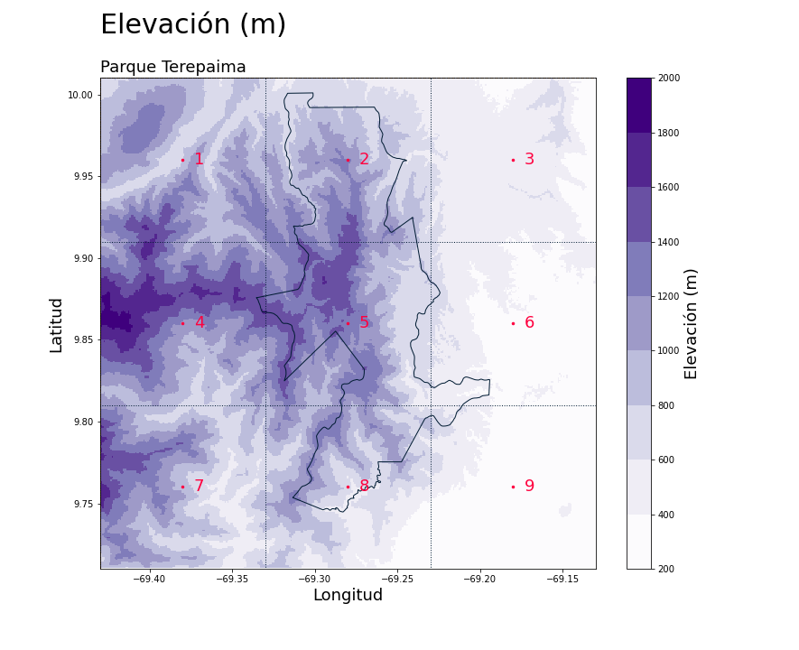
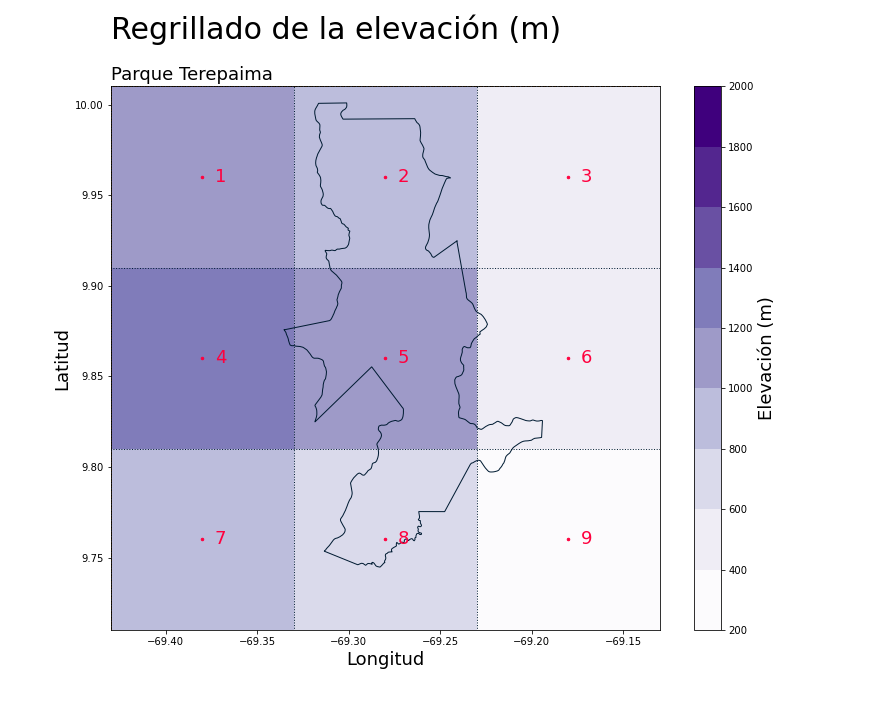
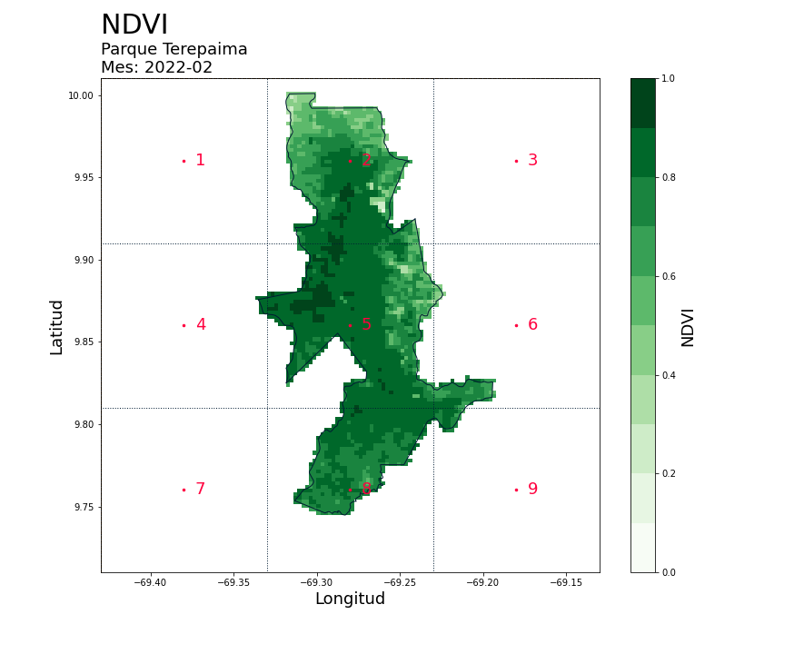
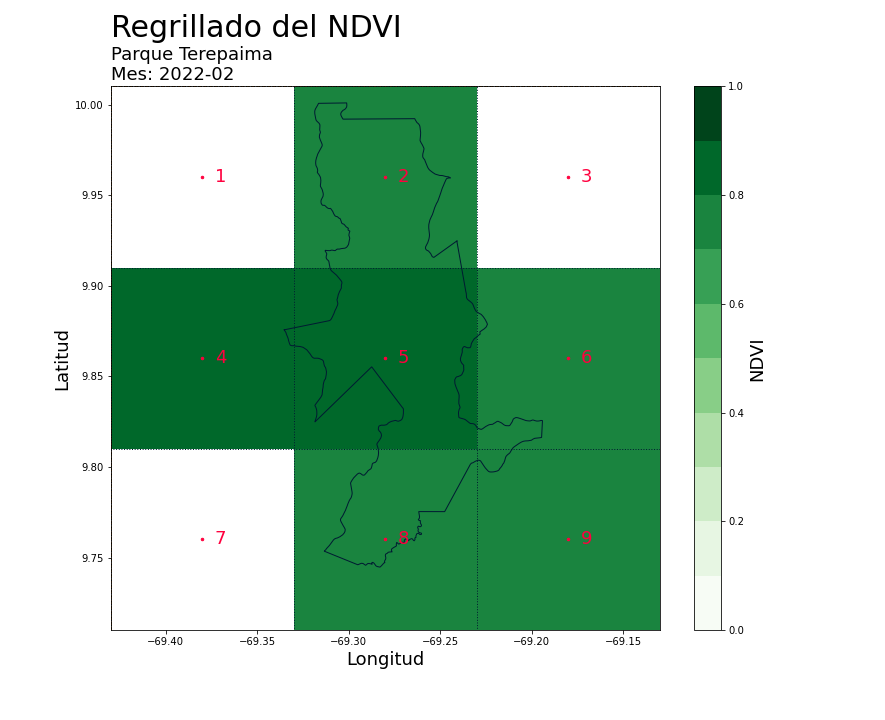

# Sistema para el Seguimiento de Ecosistemas Venezolanos (SSEV)

**Autor:** [Javier Martínez](https://esglobe.github.io/)

## Procesamiento de la Información

### General

Los procesos han sido diseñados con el objeto de descargar y tratar datos abiertos disponibles en:

* La colección **WCMC/WDPA/current/polygons** de [Earth Engine Data Catalog](https://developers.google.com/earth-engine/datasets/catalog/WCMC_WDPA_current_polygons).

* El producto [MOD13Q1v6](https://lpdaac.usgs.gov/products/mod13q1v061/) disponible en [Earthdata](https://earthdata.nasa.gov/).

* El producto [SRTMGL3v3](https://lpdaac.usgs.gov/products/srtmgl3v003/) disponible en [Earthexplorer](https://earthexplorer.usgs.gov).

* Datos de temperatura promedio (SST) en la región Niño 3.4 facilitada por los servidores de [NOAA](https://origin.cpc.ncep.noaa.gov/products/analysis_monitoring/ensostuff/detrend.nino34.ascii.txt).

* La **precipitación total** suministrada por el proyecto [Copernicus](https://cds.climate.copernicus.eu/cdsapp#!/dataset/reanalysis-era5-land-monthly-means?tab=overview).

### Inicio del proyecto

Primeramente, se recomienda generar el environment del proyecto utilizando:

~~~
conda env create -f environment.yml
conda env create -f ./environment.yml
conda activate gee_metview
conda env update --file ./environment.yml --prune
~~~

Posteriormenmte, es necesario la creación de un archivo **config.yml** que disponga de las siguientes variables para iniciar sesión en la NASA, Copernicus y MongoDb:

~~~
NASA_USER: <Usuario API NASA>
NASA_PASSWORD: <Credencial NASA>
NASA_TOKEN: <Token API NASA>
MONGO_USER: <Nombre del usuario MongoDB>
MONGO_PASSWORD: <Credenciales de usuario MongoDB>
MONGO_CLUSTER: <Cluster MongoDB>
CDSAPI_TOKEN: <Token Copernicus>
~~~

Luego, se deben ejecutar los códigos respetando el ordenamiento:

1. Ejecutar **1_descargar_mod13q1.py**, el cual permite descarga la información del producto **MOD13Q1v6** según los archivos *.json* determinados en **LAADS_querys**. Para realizar consultas es recomendable utilizar el [link](https://ladsweb.modaps.eosdis.nasa.gov/search/order/4/MOD13Q1--6/2012-01-01..2022-05-20/DB/-70,10.4,-69.2,9.9
) y modificar los valores de *PRODUCTS*, *TIME* y *LOCATION*. El *.json* correspondiente a la consulta puede ser descargado en *query results*.

2. Ejecutar **2_descarga_srtmgl3.sh** con el fin de descargar datos del proyecto **SRTMGL3**. Vale destacar que para incorporar nuevas consultas solo se deben modificar las rutas en las celdas 99-110 del código.

3. Ejecutar **3_SSTNino34_data.ipynb** para descargar datos de SST promedio en la región Nino 3.4.

### Módulos Python

En el directorio **venezuela/code** se realiza un estudio general de los porductos **MOD13Q1v6** y **SRTMGL3v3** tomando en cuenta la localización geográfica de Venezuela. Mientras que en las carpetas **cerro_saroche** y **terepaima** se dispone del procesamiento de la información para los parques Cerro Saroche y Terepaima, respectivamente. En ambos casos se parte de la misma estructura:

~~~
 ├─ parque
     └─ cdsapi
     └─ code
     └─ data
     └─ figures
     └─ MOD13Q1_V6
     └─ polygons
     └─ SRTMGL3
~~~

Donde,

- **cdsapi**: Repositorio de datos Copernicus.
- **code**: Sección de módulos Python para el precesamiento de la información.
- **data**: Localización de datos .json.
- **figures**: Localización de figuras e imágenes generadas.
- **MOD13Q1_V6**: Repositorio de datos MOD13Q1v6. 
    - **park_clip**: Datos delimitados según polígono del parque.
    - **summary**: Datos finalizada la revisión de calidad.
- **polygons**: Localización de polígonos del parque.
    - **park**: Polígono del parque.
    - **rectangle**: Polígono de la región delimitada para el parque.
- **SRTMGL3**: Localización de los datos SRTMGL3 según el polígono del parque y regrillado.

El proyecto permite replicar el estudio en parques venezolanos distinto al Cerro Saroche y Terepaima siempre que este disponible la información en **MOD13Q1v6** y **SRTMGL3v3** (ver **1_descargar_mod13q1.py** y **2_descarga_srtmgl3.sh**). En este caso solo se debe duplicar la sección **cerro_saroche** o **terepaima** y modificar los módulos en **code** tal que:

1. En los módulos **1_definir_area_cerro_saroche.ipynb** y **2_descargar_cdsapi_data.py** se descarga la información correspondiente al parque (WCMC/WDPA/current/polygons), se define la grilla y se obtiene la información de la precipitación total del producto Copernicus.

2. En los códigos **3_0_mes_mod13q1_cerro_saroche_proceso.py**, **3_1_mod13q1_cerro_saroche_proceso.py** y **3_2_qa_mod13q1_cerro_saroche_proceso.py** se limita la información del NDVI (producto MOD13Q1v6) al polígono del parque y se realiza el filtrado de calidad según las indicaciones de la NASA.

3. En **4_1_elevacion_terepaima_proceso.py** se realiza el procesamiento de la elevación correspondiente al polígono asociado a la grilla del parque.

4. En el código **5_regrillado_data.ipynb** se realiza el regrillado para la elevación y NDVI del parque.

5. La inserción de los resultados en las colecciones de MongoDB es programado en **6_meteorological_data.ipynb**.

6. En **7_polygon_data.ipynb** se realiza la inserción de los polígonos en MongoDB.

### El Parque Nacional Cerro Saroche

Los procesos desarrollados para el tratamiento de la información correspondientes al parque Cerro Saroche están disponibles en **/cerro_saroche/code/**:

1. [Definición de la región](./cerro_saroche/code/1_definir_area_cerro_saroche.ipynb).
2. [Descarga de datos para la Precipitación Total](./cerro_saroche/code/2_descargar_cdsapi_data.py).
3. [Procesamiento del NDVI](./cerro_saroche/code/3_0_mes_mod13q1_cerro_saroche_proceso.py).
    3.1 [Selección según polígono](./cerro_saroche/code/3_0_mes_mod13q1_cerro_saroche_proceso.py).
    3.2 [Filtros de calidad](./cerro_saroche/code/3_2_qa_mod13q1_cerro_saroche_proceso.py).
4. [Procesamiento de la Elevación](./cerro_saroche/code/4_1_elevacion_terepaima_proceso.py).
5. [Regrillado](./cerro_saroche/code/5_regrillado_data.ipynb).
6. [Inserción de datos procesados en MongoDB](./cerro_saroche/code/6_meteorological_data.ipynb).
7. [Inserción de polígonos en MongoDB](./cerro_saroche/code/7_polygon_data.ipynb).

### Resultados 

#### Precipitación

#### Elevación

#### NDVI

### El Parque Nacional Terepaima

Los procesos desarrollados para el parque Terepaima están disponibles en **/terepaima/code/**:

1. [Definición de la región](./terepaima/code/1_definir_area_cerro_saroche.ipynb).
2. [Descarga de datos para la Precipitación Total](./terepaima/code/2_descargar_cdsapi_data.py).
3. [Procesamiento del NDVI](./terepaima/code/3_0_mes_mod13q1_cerro_saroche_proceso.py).
    3.1 [Selección según polígono](./terepaima/code/3_0_mes_mod13q1_cerro_saroche_proceso.py).
    3.2 [Filtros de calidad](./terepaima/code/3_2_qa_mod13q1_cerro_saroche_proceso.py).
4. [Procesamiento de la Elevación](./terepaima/code/4_1_elevacion_terepaima_proceso.py).
5. [Regrillado](./terepaima/code/5_regrillado_data.ipynb).
6. [Inserción de datos procesados en MongoDB](./terepaima/code/6_meteorological_data.ipynb).
7. [Inserción de polígonos en MongoDB](./terepaima/code/7_polygon_data.ipynb).

### Resultados 

#### Precipitación

#### Elevación

#### NDVI

